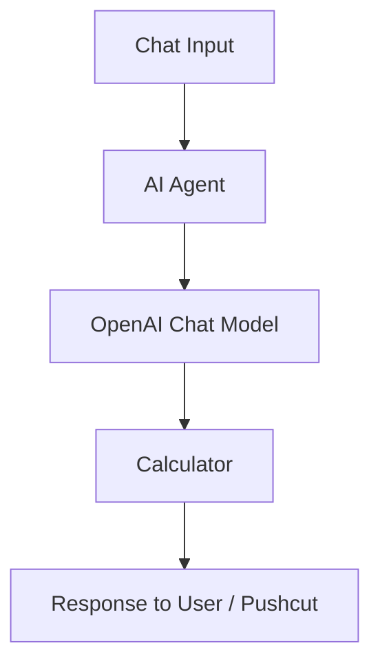
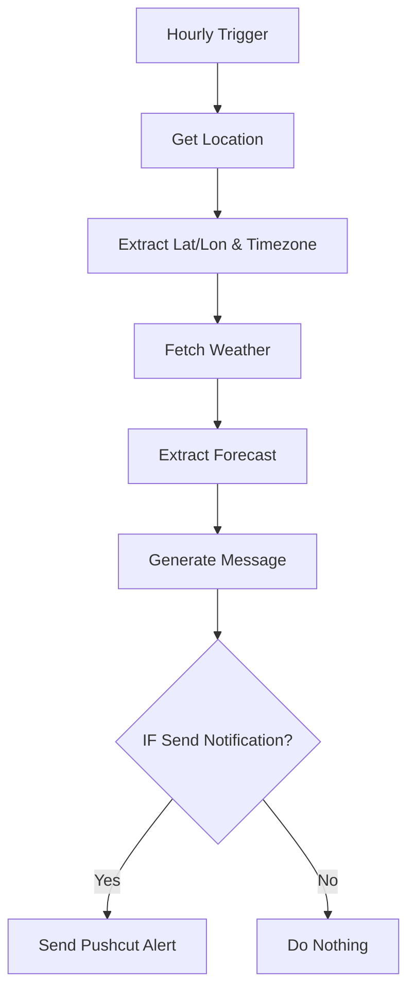

# 🤖 n8n AI & Automation Workflows

This repository contains **n8n workflows** for building and experimenting with **AI-powered automations** and **smart personal workflows** using [n8n](https://n8n.io/).

---

## 🧩 Workflow 1: Basic AI Agent Example

**File:** `Basic Agent Example.json`
**Category:** AI Agent / Automation

### 📘 Overview

The **Basic Agent Example** demonstrates how to create a simple **AI Agent** inside n8n that can process user input, perform reasoning with an LLM (like OpenAI), and use built-in tools such as a calculator.

---

### 🧠 Components Used

| Node                     | Purpose                                             |
| ------------------------ | --------------------------------------------------- |
| 🗣 **Chat Input**        | Captures user messages and passes them to the agent |
| 🤖 **AI Agent**          | Orchestrates the logic, memory, and tool use        |
| 🧩 **OpenAI Chat Model** | Generates intelligent natural language responses    |
| 💾 **Simple Memory**     | Stores short-term context between messages          |
| 🔢 **Calculator**        | Handles basic math operations                       |

---

### ⚙️ How It Works

1. User inputs text via **Chat Input**
2. **AI Agent** processes and routes the task
3. **OpenAI Chat Model** interprets and decides if a tool is needed
4. **Calculator** performs arithmetic if required
5. Response is sent back to the user

---

### 💬 Example Interaction

| Input             | Output                                |
| ----------------- | ------------------------------------- |
| `2 + 2`           | `2 + 2 is 4.`                         |
| `What is 12 * 3?` | `12 * 3 is 36.`                       |
| `Hello!`          | `Hi there! How can I help you today?` |

---

### 📱 Triggering via iPhone Pushcut

Use the webhook URL from **Chat Input** to send messages. Example:

```
https://<your-n8n-domain>/webhook/<chatTrigger-webhookId>?chatInput=Hello
```

---

### 💡 Practical Use

This workflow lets you **create a personal AI assistant** that can answer questions, perform calculations, and remember context — all **without building a full app**. Combine **n8n automation** with **Generative AI** to **rapidly prototype intelligent agents** for notifications, productivity, or custom workflows.

---

### 🖼 Diagram



---

## 🧩 Workflow 2: Rain & Reps — Hourly Weather Gym Buddy

**File:** `Rain & Reps.json`
**Category:** Personal Productivity / IoT

### 📘 Overview

This workflow automatically fetches **weather updates** and **tracks your gym streak**, sending **personalized Pushcut notifications** to your phone.

---

### 🧠 Components Used

| Node                              | Purpose                                             |
| --------------------------------- | --------------------------------------------------- |
| ⏰ **Hourly Trigger**              | Triggers the workflow every hour                    |
| 🌍 **Get Location**               | Retrieves current latitude, longitude, and timezone |
| 🗺 **Extract Lat/Lon & Timezone** | Extracts usable location info                       |
| 🌦 **Fetch Weather**              | Calls OpenWeatherMap API for forecast               |
| 🔎 **Extract Forecast**           | Extracts next 12-hour forecast                      |
| 📝 **Generate Message**           | Formats weather, forecast, gym streak, and emojis   |
| 🔀 **IF Send Notification**       | Sends only if notification is needed                |
| 📱 **Send Pushcut Alert**         | Sends the final notification to your phone          |

---

### ⚙️ How It Works

1. **Hourly Trigger** fires automatically
2. **Location** is fetched using IP info
3. **Weather Forecast** is retrieved from OpenWeatherMap
4. **Next 12h forecast** is processed, rain probability calculated
5. **Gym streak** is updated if within 6 AM–6 PM
6. **Pushcut Alert** is sent with weather + streak + emojis

---

### 💡 Practical Use

Turn routine checks into a **hands-free, real-time habit tracker** with **location-aware weather updates** and **gym streak notifications**. No app development required — **n8n automates everything**.

---

### 🖼 Diagram



---

### 🧰 Requirements

* n8n instance (local or hosted)
* OpenWeatherMap API key
* Pushcut account for notifications
* Internet connection

---

### 🚀 How to Import

1. Open n8n instance → **Workflows → Import → Upload**
2. Select the JSON file
3. Activate workflow

---
